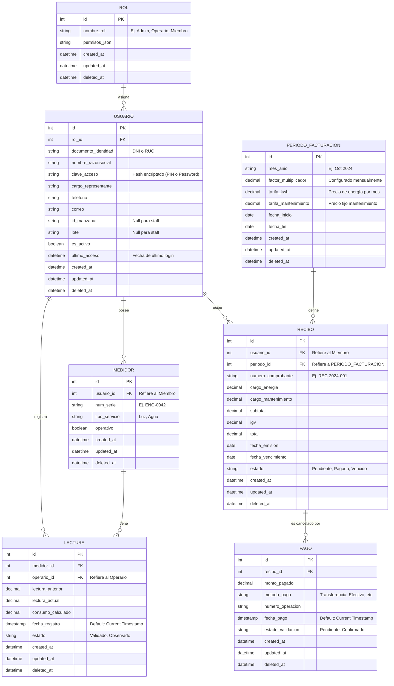

# Modelo de Entidad-Relación (Estructura Profesional)

Este modelo refleja una arquitectura de base de datos normalizada y escalable para el sistema del Parque Industrial Jicamarca. 

## Diagrama Visual (Mermaid)

## Diccionario de Tablas y Patrones Profesionales

### 1. Campos de Auditoría (En todas las tablas)
Toda tabla profesional incluye los campos:
- `created_at`: Se genera automáticamente por el motor de BD al hacer el *INSERT*.
- `updated_at`: Se actualiza automáticamente en cada *UPDATE*.
- `deleted_at`: Se utiliza para el **Borrado Lógico** (Soft Delete).

### 2. Tabla `ROL` y Normalización
Los roles ("Admin", "Operario", "Miembro") ya no están escritos a mano como texto. Se manejan en su propia tabla `ROL`. 
- **Escalabilidad:** Esto permite crear nuevos roles (ej. "Auditor") sin tocar el código y asignar permisos dinámicos a través del campo `permisos_json`.

### 3. Tabla `USUARIO`
- `clave_acceso`: Se estandariza el nombre del campo. Guardará un Hash encriptado tanto si el usuario configuró una contraseña alfanumérica como si es un operario con un PIN numérico.
- `ultimo_acceso`: Registrará la estampa de tiempo (timestamp) cada vez que el usuario haga Login exitosamente.

### 4. Tabla `PERIODO_FACTURACION`
Esta es una adición crítica para sistemas de facturación industrial. 
- En lugar de poner el **factor multiplicador** y las **tarifas** a cada medidor de forma individual, se centraliza en un Período Mensual. Así, al cerrar el mes, el administrador configura la tarifa y el factor aplicable a ese mes para todos en bloque.

### 5. Timestamps Automáticos
Los campos como `fecha_registro` (en Lecturas) y `fecha_pago` (en Pagos) están configurados como `timestamp`. Esto significa que la base de datos toma la hora exacta del servidor en el momento de la inserción, evitando errores humanos u horas desfasadas.
